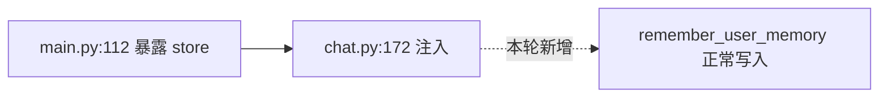

# Closing Review 与 Human Handoff

# Vision Review 闭环

`REVIEW-*` 行用于判断整批工作是否按批准文档完成，并把实施结果与科学结果分开记录。
同一规则适用于目录化 CSV 与 legacy 平铺 CSV。

## Review 前置条件

- 先用 `final_ready.py` v2 对 28 列状态、remote terminal state、实验身份、metrics token、provenance、claim 终态和 scoped git status 做机械检查，并传入 `closing_context`：`risk_level`、`independent_prerun_covered`、`scientific_contract_changed_since_prerun`、`evidence_conflict`、`current_scope_gap_suspected`。失败时修当前 REVIEW 行，不创建等待型 REVIEW。
- 科研 `review.md` 继续承载 remote session、artifact pull/ingest、指标、SpecID/ExpID/RunID 与结果归属；closing reviewer 只消费这些证据，不改写 scientific PRERUN 结论。

- 当前 review 行之前的所有非 review 行必须闭环完成
- 若前面仍有未完成的普通 issue，先跳过当前 review 行，继续普通 issue
- review 不实现功能；review 只审计、记录、追加可执行工作
- review 行必须包含任务专属 claim/evidence 检查项；如果 `review_regression_requirements` 仍是纯通用套话，先回读 `source_doc`、当前 CSV 和交付证据，补齐该行后再执行 review
- 若任意行 `notes` 包含 `claims:CLAIM-*` 但没有可读的 `claim_ledger:<path>`，CSV 不完整；先在 artifact root 补齐 `<csv-basename>.claims.json` 并写回 `claim_ledger:<csv-basename>.claims.json`，不得把 claim id 当作可审计证据
- 若输入 CSV 原本没有 review 行，运行 `ensure_review_row.py` 合成 `REVIEW-01`；这类 review 只引用 `source_csv` 和确实存在的 sidecar，不补造 `source_doc`、claim ledger 或 outcome contract

## Review 输入

closing review 必须基于以下材料：

- canonical 任务使用 approved spec；兼容任务使用 `source_csv` 和所有普通行的 scope/acceptance 数据
- 当前 CSV 的全部行和状态
- 确实存在的 claim/evidence ledger、Outcome Contract 和 Deferred Findings ledger；兼容 CSV 缺少这些 sidecar 时保持缺省
- 当前代码 diff / commit 记录
- 测试与 MCP 证据
- 交付物中的声明：文件名、函数名、测试名、metadata、报告、CSV notes、状态更新和 commit message
- 已存在的 review log

不要把当前会话里的主观总结当作唯一依据。

## Review 执行

### Closing 路由

先按风险选择路径，不默认调用独立 reviewer：

1. `final_ready.py` 返回 `decision:evidence_close` 时直接使用 `evidence-close`；它机械保证满足以下任一条件且没有 evidence conflict/current-scope gap：
   - L0–L2 普通任务已完成风险匹配测试；
   - 科研任务的同一 `pre_run_code_commit` 已完成独立 scientific PRERUN，且之后没有改变 scientific contract、数据流、computation sink、指标或结果归属。
2. `final_ready.py` 返回 `decision:independent_review_required` 时才进入下面的独立 capability ladder：L3/L4 交付没有等价独立审查、机械证据互相冲突、claim/evidence 疑似高估或发现 current-scope gap。
3. `evidence-close` 由主会话基于结构化证据完成，不再次调用模型，记录 `review_agent_mode:evidence-close`、`review_independence:false`、三个模型字段均为 `not_applicable`。

### 独立 capability 阶梯

需要独立 review 时，按顺序选择第一条可执行路径，并把选择结果写入 review log 与 CSV `notes`：

| 优先级 | 模式 | 记录值 | 独立性 | 要求 |
|--------|------|--------|--------|------|
| 1 | 当前会话派发注册的 `reviewer` 子代理 | `review_agent_mode:reviewer-subagent` | `review_independence:true` | 请求 `gpt-5.6-sol` high；只读；prompt 不含主代理结论；禁止再委派 |
| 2 | `codex exec --ephemeral --json -m gpt-5.6-sol --sandbox read-only` | `review_agent_mode:codex-exec-independent` | `review_independence:true` | 用 `shutil.which("codex")` 解析平台 launcher；由独立 exec 会话完成完整 vision review |
| 3 | 主会话按同一 prompt 自审 | `review_agent_mode:self-review` | `review_independence:false` | 只在前两项失败时使用；如实记录 capability failure，但完成的 self-review 可以闭环 |

`codex review` 只能补充 Git diff 证据，不是 closing mode。运行过 diff-only review 后，仍要走上述阶梯完成 vision review。

用 `scripts/run_vision_review.py` 执行第 2 项；脚本找不到 CLI 或调用失败时，记录原因并进入 self-review。

脚本用法（路径相对本 skill 目录）：

```bash
python scripts/run_vision_review.py \
  --csv <csv-path> \
  --source-doc <source-doc-path> \
  --claim-ledger <claim-ledger-json-path> \
  --outcome-contract <outcome-contract-json-path> \
  --deferred-ledger <deferred-ledger-json-path> \
  --review-log <csv-path-without-.csv>.review.md \
  --output reviews/review-01.json \
  --handoff <csv-path-without-.csv>.handoff.md \
  --workdir <repo-root> \
  --model gpt-5.6-sol
```

兼容 CSV 没有 source doc 时省略 `--source-doc`。脚本成功时输出 review JSON；把 JSON 摘要写入 review log，并把 `review_json:<path>`、mode、independence、requested/observed model、model evidence、coverage、result 和必要的 `validation_limited` 写入 CSV `notes`。脚本失败不等于 review 完成：记录失败原因后进入 self-review。

### Reviewer prompt 硬要求

reviewer prompt 必须明确写入：

- 独立路径固定请求 `gpt-5.6-sol`；requested model 与 observed model 分开记录
- observed model 只能来自 host/session metadata 或 CLI JSON event stream。reviewer 文本和 review JSON 自报的模型不算证据
- 只基于批准文档或原始请求、CSV、claim/evidence ledger、diff/commit、测试/MCP 证据、交付物声明和 review log
- 不信任主 agent 的结论性总结
- 不为了找问题而找问题；只有可证伪差距才算 gap
- 每个 gap 必须包含 `source_ref`、`evidence_ref`、`why_it_matters`、`suggested_followup_issue`
- 必须检查声明与证据等级是否一致，尤其是替代验证是否被包装成原目标通过
- 每个发现先分为 `current-scope gap`、`human-required blocker`、`deferred_improvement` 或 `future_decision`
- `current-scope gap` 只能进入 `gaps`，不得延期；后两类写入 `deferred_findings`，按语义和证据去重，不得自动变成 follow-up issue

`result` 只描述 Mission 实施与执行，不描述假设是否成立：
   - `vision_met`: 已按批准协议实现并执行；预注册门限得到负结果或合法跳过后续阶段仍可使用此值
   - `gaps_found`: 存在 current-scope 实施、执行或证据差距
   - `limited_review`: 证据不足，无法判断当前承诺是否按协议完成

`scientific_outcome` 单独记录：`hypothesis_supported / hypothesis_not_supported / gate_failed / inconclusive / not_applicable`。禁止把 `gate_failed` 自动转换成 `gaps_found`。

将本轮结论写入 `<csv-path-without-.csv>.review.md`，与 CSV 同目录。`reviews/` 只保留 closing 所需的一个最终结构化 review JSON；prompt、JSONL、stderr、重试状态和中间输出默认不落盘，失败摘要直接写入 review.md 的执行日志。

## Human Handoff 产物

REVIEW 行执行后，必须产出一份面向人类的交接文档 `<csv-path-without-.csv>.handoff.md`，与 CSV 同目录同前缀。

### 定位

handoff 是**施工交工单**——用户隔一段时间回来打开它，能还原"这轮干了什么、干成什么样、还剩什么"的完整画面，不需要翻 CSV、不需要翻 claims.json、不需要翻 git log。

它与 review.md 分工不同：

| 文件 | 读者 | 目的 | 写法 |
|------|------|------|------|
| `review.md` | reviewer / 下一轮 review / agent | 证明审过什么、有没有 gap | 结构化审计日志，可以用内部编号 |
| `handoff.md` | 人（决策者） | 跨 session 一眼看懂做了什么、没做什么、下一步 | 跟 spec 同风格的大白话叙事 |

### 内容结构（必须按此顺序）

#### 第一层：先看结论（3 秒读完）

一段话，用大白话说清楚：
- 这轮执行的是哪篇 spec / 设计文档
- 整体判定是 `pass / fail / partial / unknown / not_run` 中的哪一个
- 什么决定性结果或第一处失败支撑这个判定
- 最重要的一条 blocked claim 是什么

示例风格：

> 本轮实现了 Memory Foundation 设计里的五项核心能力中的四项。MemoryRecord 入库、状态机流转、Consolidator 事件消费、检索注入都已完成并通过测试。L3 playbook 自动提炼降级为 proposed-only，因为多证据融合算法 spec 没给具体规则，当前只标记 eligibility 不自动 activate。

#### 第二层：这份交工单告诉你什么

用一段话说明 handoff 的角色、证据输入、读者和边界：它解释 spec、代码、测试、trace、score 和 review 证据，但不生产运行结果、不覆盖 canonical scorer，也不把“代码完成”写成“能力已证明”。

#### 第三层：你现在可以确定什么（30 秒浏览）

逐条呈现 Outcome Contract 的 reader questions，不暴露 `OUTCOME-*` id，也不改写问题文本：

| 你关心的问题 | 判定 | 直接答案 | 关键证据 | 可信度 | 结论边界 | 下一步 |
|---|---|---|---|---|---|---|

答案判定只允许 `pass / fail / partial / unknown / not_run`；可信度只允许 `high / moderate / low / unknown`。每个问题必须有证据引用、边界和下一步。没有证据时写 `unknown` 或 `not_run`，不能猜。

这一张表由 review JSON 机械渲染。问题、判定、直接答案、证据（多个引用用 `; ` 连接）、可信度、边界和下一步必须与 review JSON 逐字段一致。

#### 第四层：决定整体状态的结果

说明成功条件、本轮实际到达的最后正常阶段、第一处失败或证据缺口，以及整体判定。必须分开实现状态、验证状态和能力结论。

#### 第五层：目前仍不能声称什么

逐条呈现 Outcome Contract 的 blocked claims：

| 不能声称的结论 | 原因 | 解除条件 |
|---|---|---|

`partial`、`unknown`、`not_run` 不得在总结中合并成 pass 或“能力完成”。
表中的 claim、原因和解除条件必须与 Outcome Contract 逐字段一致。

#### 第六层：spec 目标逐条对账

以 spec 定义的能力/目标为单位（不是 CSV 行号），用表格或编号清单列出每项：

| spec 目标 | 状态 | 实际效果 | 备注 |
|-----------|------|----------|------|
| 用 spec 自己的语言描述这项能力 | 完成 / 部分完成 / 降级 / 未开始 | 一句话说改完之后系统行为有什么不同 | 如果降级或未完成：为什么、差什么 |

规则：
- 目标描述从 spec 文档提取，用 spec 自身的表达方式（不是你自己编的抽象）
- 但如果 spec 原文太长或太散文化，提炼为一句话
- "实际效果"必须从用户/产品视角写，不是从代码视角——说"搜索现在能找到联系人邮箱了"而不是"research_contacts 返回非空 list"

#### 第七层：施工细节

按模块或功能区域组织（不是按 CSV 行号），每块覆盖以下角度（有什么写什么，不强制每块都写全）：

- **改了什么**：碰了哪些文件/函数，改之前怎样、改之后怎样
- **行为场景**：给一个具体的用户操作场景说明效果。格式："你在前端做 X → 系统现在会 Y → 以前是 Z"。让读者有画面感，能直接去试
- **踩了什么坑**：执行过程中发现的问题、根因是什么、怎么修的
- **做了什么决策**：spec 没明确说但执行时必须选择的点，选了什么、为什么
- **意外发现**：spec 没预料到但执行时撞上的东西（设计缺口、隐含假设、产品疑问）。这类信息对 spec 作者特别重要
- **质量判断**：这块代码是扎实的还是凑合能用的？哪里是薄弱点、后续可能还要投入？诚实评估
- **集成影响**：这次改动对已有功能的副作用——碰了什么共享接口、改了什么公共逻辑、可能影响哪些既有行为
- **产品洞察**：站在实现者角度看到的产品设计问题或改进机会。spec 阶段想不到的东西，实操才能发现

用对照表或箭头流程图让变更可视化，示例：

```text
改之前：聊天 runtime 没有注入 store → remember_user_memory 报错
改之后：main.py:112 暴露 store → chat.py:172 注入 → 工具正常写入
```

```text
行为场景：你在聊天里说"记住，报价加 5%"
→ 系统调用 remember_user_memory 写入 /memories/sop/pricing.md
→ 下次新对话问"我的报价规矩是什么"，系统自动读取并回答
→ 以前：工具报错 "store is required in RunnableConfig.configurable"
```

**数据流 / 架构变更必须配 mermaid 图**

当本轮变更命中以下任一情形，第三层必须额外配 mermaid 图，而不是只用文字描述：

- 数据流经多层（请求 → 中间件 → 业务 → 数据层）发生改变
- 模块/文件之间的调用关系被新增、删除或改向
- 架构边界调整（职责从 A 搬到 B、某层被降级或升格）

规则：

- **最多两张**：一张"改之前"、一张"改之后"，让读者用 diff 视角一眼看出变更骨架。只动一处时画一张即可。
- 图只画与本轮变更相关的节点和边，不画整个系统全景——全景会淹没变更点（与"靶向展开：一条链不答一张图"一致）。
- 图必须落点到变更：改后图里要能指出"哪个节点/哪条边是这轮动的"，用标签或虚线标出来。
- 纯文案、单函数内部逻辑、不涉及跨文件/跨层关系的改动，不强制画图——数据源薄就如实写薄，不为凑可视化硬画（与下方风格硬规则第 6 条一致）。
- **降级**：mermaid 语法写不出或渲染失败时，回退到上面的 ASCII 箭头块，不阻塞 handoff 落盘、不阻塞 mission 闭环（handoff 永远不比代码交付优先）。

示例（改后数据流，虚线 = 本轮新增的边）：



#### 第八层：验证情况

- 跑了什么测试、结果如何（精简，一两行够了）
- 哪些验证是降级的（没跑真实服务、缺凭证等），如实说
- 不要把这部分当主角——前三层才是重点

#### 第九层：后续可操作

- **还剩什么**：未完成项、需要产品决策的点、已知限制
- **阻塞/配置**：如果有需要用户动手的事（配置凭证、启动服务、审批、购买），明确列出解除条件
- **怎么复现**：如果用户想自己验证，给完整的 E2E 步骤（启动什么、输入什么、期望看到什么）
- **去哪看**：如果有可观测数据（监控面板、trace 系统、日志、DB 查询），告诉用户地址和过滤条件

这一层是泛用的——有什么写什么，没有就不写。不要硬编码特定工具名称。

若 Deferred Findings ledger 中存在 `status=open` 的记录，必须在“后续可操作”之前增加独立的 `## 待讨论` 章节：

- 每条开放记录都用自然中文说明“发现了什么、证据是什么、为什么不阻塞本轮、需要用户决定什么”。
- 每条正文前保留隐藏标记 `<!-- deferred:DF-001 -->`，用于机械覆盖检查；可见标题和正文不得出现 `DF-001`、`deferred_improvement`、snake_case 等内部审计文本。
- 不得把当前 scope/acceptance gap 写进该章节。未完成的当前承诺仍放在“还剩什么”，并由正式 follow-up issue 负责。
- machine ledger 不经过 `humanizer-zh`；handoff 的可见正文必须经过 `humanizer-zh`。隐藏标记、trace id、路径和结构化证据不得改写。

### 风格硬规则

1. **以 spec 目标为锚**：结构跟着 spec 走，不跟着 CSV 行号走，不跟着 CLAIM 编号走
2. **自包含**：不引用 CLAIM-XXX 编号，不说"见 claims.json"。所有信息必须内联展开，读者不需要打开任何其他文件
3. **跟 spec 同风格**：用对照表、结论句、箭头流程图或 mermaid 图（数据流/架构变更优先 mermaid）。先说结论再说细节。术语第一次出现时用括号解释它是什么
4. **大白话优先**：先说产品效果（"用户记忆现在跨项目可读了"），再说技术路径（`user_memory.py:51 namespace 没有 project_id`）
5. **不写审计话术**：禁止 "scope checked" / "evidence checked" / "claim coverage" / "vision_met" 这类 review 模板用语。这些属于 review.md，不属于 handoff
6. **详细但不冗余**：每项覆盖完整，但每条精炼。同一事实不换三种说法重复。数据源薄就如实写薄，不编造篇幅
7. **诚实标注不确定性**：降级了就说降级了，没验证就说没验证。不用漂亮话包装

### 生成规则

- 走脚本（第 2 项）时，传 `--handoff <path>`，让 reviewer 在同一次 pass 里产出 `handoff_markdown` 草稿。
- 走注册 `reviewer` 子代理（第 1 项）时，prompt 必须要求返回 `handoff_markdown`，并传入上述结构和风格规则。
- 走 self-review（第 3 项）时，handoff 顶部必须写 `WARNING: self-review only, NOT independently verified`，记录 `review_independence:false`，不得让自评看起来像独立结论。
- handoff 是**只读派生产物**：内容来自 source doc / CSV / review JSON / 代码实际状态，禁止手工编辑；要改内容就重跑 review 重新生成。
- handoff 内容硬约束：每句话必须可追溯到上述数据源，禁止用固定模板或漂亮话填充篇幅（与项目硬门禁"不得用输出修补伪装能力"一致）；数据源薄就如实写薄，不许编。
- 生成后在 REVIEW 行 `notes` 追加 `handoff:<path>`。
- 合并 reviewer 新发现到 `<stem>.deferred.json`：只接受 `deferred_improvement` / `future_decision`，按“含义 + evidence_refs”去重，分配稳定 `DF-NNN`；在来源 CSV 行 notes 写 `deferred_findings:<ids>`。
- 先运行 `python <skill-dir>/scripts/validate_deferred_ledger.py <csv-path> --workdir <repo-root>`。失败时修 ledger 或 notes，不得继续做 handoff contract check。
- handoff 完成后在最新 REVIEW notes 回填 `deferred_coverage:<covered>/<open>`。
- **落盘后必须跑 handoff contract check**（机械验收，不信 reviewer 自报）：
  - 运行 `python <skill-dir>/scripts/check_handoff_contract.py <handoff-path> --csv <csv-path>`。
  - contract check 会确认 `.handoff.md` 命名、REVIEW notes 的 `handoff:<path>`、markdown 骨架；存在开放 Deferred Findings 时，还会逐条核对隐藏标记、`deferred_coverage` 和 `handoff_humanized:true`。
  - 新任务存在 `outcome_contract:<path>` 时，CSV notes 还必须有 `review_json:<path>` 和 `handoff_humanized:true`；contract check 会校验 contract schema、review JSON 自洽性、每个 reader question/blocked claim 与 handoff 表格逐字段一致、核心语义章节与答案列齐全。缺任一项均失败。
  - 退出码 0 = 通过；在 REVIEW 行 `notes` 追加 `handoff_contract:passed`。
  - 退出码 1 = 不合格：如果是路径或 notes 缺失，先修正 CSV notes 后重跑；如果是 markdown 残件，**重生成一次** handoff 后重跑。
  - 重试后仍失败：在 REVIEW 行 `notes` 追加 `handoff_contract:failed <缺项>`。允许代码交付继续收口，但不得把本轮 review 写成 `vision_met`，最终回复必须明说 handoff 不合格，不能声称"handoff 已完成"。

### humanizer-zh 后处理（必须）

reviewer 产出的 `handoff_markdown` 是草稿，落盘前**必须**经过 humanizer-zh 处理。目的是去除 AI 生成痕迹，让文档读起来像人写的。

流程：

1. reviewer 产出 `handoff_markdown` 草稿（信息完整性由 reviewer 保证）
2. 主 agent 调用 `humanizer-zh` skill 对草稿进行语言润色
3. 润色后的版本才是最终 handoff，写入 `<csv-path-without-.csv>.handoff.md`

Outcome answer 表、blocked claim 表、Deferred Findings 隐藏标记、trace id 和结构化证据属于机械字段隔离区，`humanizer-zh` 不得改写；只润色可见说明文字。否则 handoff 无法与 review JSON / Outcome Contract / deferred ledger 对账，contract check 必须失败。

润色规则以 humanizer-zh skill 本身为准。

若 humanizer-zh 不可用（skill 未安装或调用失败）：
- 只允许把原稿保存为 `<csv-path-without-.csv>.handoff.draft.md`，不得覆盖正式 `.handoff.md`
- 在 REVIEW 行 `notes` 追加 `handoff_humanized:false; blocked:humanizer-zh unavailable`
- `check_handoff_contract.py` 必须失败，当前 REVIEW 不得标记完成、不得写 `vision_met`
- humanizer-zh 恢复后，从 draft 重新执行润色、写正式 handoff，并把 notes 更新为 `handoff_humanized:true`

### handoff 生成失败的降级（反卡死）

若脚本 / reviewer 未能产出 `handoff_markdown`（输出截断、JSON 不合法等）：

- 在 REVIEW 行 `notes` 记 `handoff:generation_failed <reason>`。
- 主 agent 用 review JSON + CSV + 代码现有数据，按上述内容结构手动渲染一份兜底 handoff，顶部标 `WARNING: auto-generation failed, rendered by main agent as fallback`。
- 兜底草稿仍必须经过 humanizer-zh，机械字段隔离规则不变。处理后写入 `<csv-path-without-.csv>.handoff.md`，并在 REVIEW 行 `notes` 追加 `handoff:<path>; handoff_humanized:true`。
- 随后运行 `check_handoff_contract.py`。若生成或 humanizer 仍失败，当前 REVIEW 保持未完成，不得静默降级为合格 handoff。

## 发现问题时

先分类，不能把不同性质的问题混成一批 follow-up：

| 分类 | 判断标准 | 处置 |
|------|----------|------|
| `current-scope gap` | 违反 source doc、当前 issue acceptance criteria、生产接线要求或声明-证据合同 | 现在修；无法在原行修完时追加正式 follow-up issue 和下一轮 REVIEW，继续执行 |
| `human-required blocker` | 只有用户或外部主体能提供授权、凭证、付费/业务决定或不可逆操作 | 记录 blocker，继续其他可推进行；全部剩余项都属于此类时才停 |
| `deferred_improvement` | 当前承诺已经满足，但观察到范围外的质量、评估或架构改进 | 写入 deferred ledger，不追加 issue |
| `future_decision` | 当前承诺已经满足，但后续产品或架构存在真实取舍，需要用户决定 | 写入 deferred ledger，不追加 issue |

拿不准是否属于当前范围时，回读 source doc、Outcome Contract 和 acceptance criteria。证据不足不能成为延期理由；只要可能影响当前承诺，就按 `current-scope gap` 处理。

若结论为 `gaps_found`，只把其中的 `current-scope gap` 转成执行工作：

1. 将每个差距转换为新的 follow-up issue，追加到当前 CSV 尾部
2. 再追加下一轮 review 行：`REVIEW-(N+1)`
3. 当前 `REVIEW-N` 标记为闭环完成
4. 提交当前 CSV、review log，以及必要的文档更新
5. 继续执行刚追加的 follow-up issue，不等待用户

`deferred_improvement` 和 `future_decision` 进入 `<artifact-root>/<stem>.deferred.json`。在发现它的 CSV 行 notes 追加 `deferred_ledger:<path>; deferred_findings:<ids>`。同一问题跨 issue 或 review 重复出现时更新原记录的 `source_issue_ids` / `evidence_refs`，不得重复造 id。

追加后的顺序示例：

```text
ISSUE-01
ISSUE-02
REVIEW-01
FOLLOWUP-01
FOLLOWUP-02
REVIEW-02
```

## Human-required blockers

只有人类不可替代时才停止。

允许停止的情况：

- 需要破坏性或不可逆授权：删除用户数据、重置数据库、强制覆盖用户未提交改动、修改或泄露密钥
- 缺少 agent 无法获取的外部凭证、账号、权限、付费决策、法律/安全/业务决策
- 必需的第三方或人工动作位于工作区外，agent 无法完成
- 继续执行会要求伪造证据、凭证、数据或用户意图

其他问题不一定要扩张当前 CSV：

- 架构分歧
- 范围细节不清
- 产品细节不完整
- 实现路线不确定
- review 发现不影响当前承诺的质量改进或未来决策

处理方式：

- 在 review log 写 `Assumption` / `Decision Debt` / `Risk`，并记录 Deferred Findings 摘要
- 在 CSV notes 写 `assumption:<...>`、`decision_debt:<...>`、`risk:<low|medium|high> <...>` 或 `deferred_findings:<ids>`
- 选择最小可逆路径
- 只有 current-scope gap 才追加 follow-up issue
- 继续执行

## Review log 格式

文件：`<csv-path-without-.csv>.review.md`

- `issues/<stem>/<stem>.csv` → `issues/<stem>/<stem>.review.md`
- Legacy: `issues/<topic>.csv` → `issues/<topic>.review.md`
- External: `<dir>/<topic>.csv` → `<dir>/<topic>.review.md`

每轮追加：

```markdown
## REVIEW-N
- Source doc: <path>
- Review agent: reviewer-subagent | codex-exec-independent | self-review
- Review independence: true | false
- Review requested model: gpt-5.6-sol
- Review observed model: <catalog model id | unknown>
- Review model evidence: session-metadata | event-stream | parent-runtime | unknown
- Scope checked: <goals/non-goals/acceptance areas>
- Evidence checked: <commits/tests/MCP/logs>
- Claim coverage: complete | gaps | unknown
- Claim/evidence alignment: matched | mismatches found | limited
- Limited validation honestly reported: yes | no | not_applicable
- Handoff humanized: true | false
- Result: vision_met | gaps_found | limited_review
- Scientific outcome: hypothesis_supported | hypothesis_not_supported | gate_failed | inconclusive | not_applicable
- Gaps: <none or bullet list>
- Follow-up issues added: <none or ids>
- Assumptions: <none or bullet list>
- Decision debt: <none or bullet list>
- Deferred findings: <none or ids + concise evidence summary>
- Human-required blockers: <none or exact blocker>
```

## Review 行闭环

`REVIEW-N` 只有在 review log 已写入、handoff.md 已生成（或已记 `handoff:generation_failed` 并产出兜底）、且 handoff contract check 结果已写入 notes 后才能完成：

- 若 `vision_met`：必须同时满足 `handoff_contract:passed`；标记 `REVIEW-N` 完成，若无其他未完成行则结束 CSV。开放 Deferred Findings 或负向 `scientific_outcome` 只进入 handoff 的“待讨论/科学结论”，不阻止按协议闭环
- 若 `gaps_found`：把其中的 current-scope gaps 追加为 follow-up issue，再追加 `REVIEW-(N+1)`；标记 `REVIEW-N` 完成并继续
- 若 `limited_review` 且没有可执行 gap：标记当前 review 行完成，并如实记录缺失证据；不得仅为等待独立能力变化追加 `REVIEW-(N+1)`
- 若存在 human-required blocker：记录 blocker，保持 `git_state=未提交`，停止并请求最小必要输入

当全部行已满足 closing-ready（`dev/review` 三状态完成且没有 `running_remote`）时，直接校验并提交已经位于终态路径的最小工件；不再增加“终态压缩”步骤，也不生成 `artifact-index.json`。

`compact_artifacts.py` 只服务于升级前遗留 Mission。只有用户明确要求归档/GC 某个 legacy artifact root 时才以 dry-run → `--apply` 使用；新 Mission 和普通 closing 禁止调用。
